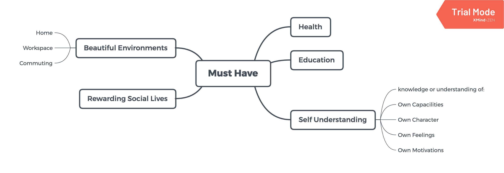

# 消费主义

## 无节制消费的元凶

https://movie.douban.com/subject/25945379/

**非必需品**

- Commodity

**必需品**

判别必需/非必需，不是简单的二元论。

more for self less for others, buy;  
more for others less for self, do not buy.

new consumerism:  
focus on buying and selling service and goods for higher needs

---

## 消费社会

https://book.douban.com/subject/1089142/

**由来**

- 18 世纪前，个人拥有财产几乎无变化
- 工业革命，过剩生产力，人为创造需求。消费 -> 生产 -> 就业 -> 消费。社会总财富增加
- 创造的需求低级荒谬
- 真正的需求：健康，教育，精神富足

**消费主义的本质**

- 占有 —— 生命虚无，寻找意义，物能比人更永久的存在
- 享受 —— 不必要的需求
- 自我认同 —— 商品符号化，优越感，情感价值。属于创造需求

**警惕消费主义，不是全反**

- 非占有 —— 与物不是占有关系，而是与物互相行为之间的存在关系（体验）
- 非享受 —— 必要的需求：衣食住行，够的程度，消费适度
- 非错误自我认同 —— you are not what you shopped。自我存在的意义（体验）

---

## 贫穷的本质

https://book.douban.com/subject/21966353/

- 认知差异
- 健康：预防优于治疗
- 教育：私立/公立，降低家长期望、注重核心能力开发
- 省钱：大目标 -> 小目标 -> 目标达成激励循环
- 赚钱：
  - 边际收益，穷人往往从事多个边际收益趋稳的工作
  - 多收入渠道
